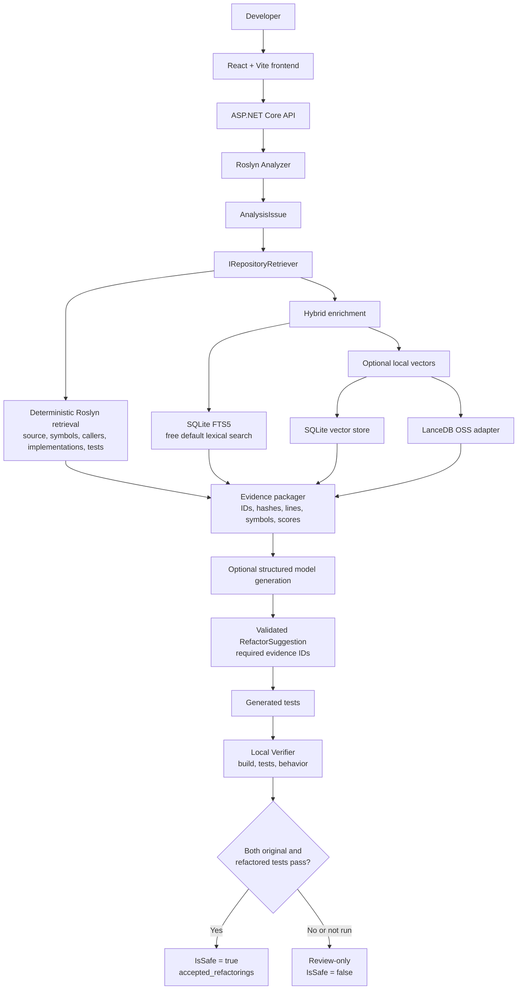

# Legacy Modernization Copilot

Local-first tooling for analyzing legacy .NET projects, retrieving repository evidence, generating modernization suggestions, and verifying behavior with tests.

## Readiness

The backend and local RAG path are implemented and validated. The project does not require PostgreSQL, hosted infrastructure, or paid model services to start.

Current validation:

- Backend RAG tests: 6 passed.
- Python RAG tests: 6 passed.
- Backend API build: passed.
- Local retrieval evaluation smoke test: Recall@10 1.0, MRR 1.0.
- Docker Compose validation: not run in the current environment because Docker is not installed.
- Frontend build: requires `npm install` first; it was not available in the current environment because `node_modules` is absent.

Gemini generation is optional. Without `GEMINI_API_KEY`, the application returns review-only results and never marks a suggestion safe.

## Architecture



**Source of truth:** deterministic Roslyn evidence. SQLite FTS5 and optional local vectors only enrich or rerank evidence. The verifier is the only authority that can set `IsSafe`.

## Prerequisites

- .NET 10 SDK.
- Node.js and npm for the frontend.
- Python 3.11+ for the optional Python RAG worker and evaluation tools.
- Docker Desktop only if using the Compose workflow.

No PostgreSQL server is required.

## Configuration

Copy the example configuration to a local environment file. Do not commit secrets.

```powershell
Copy-Item .env.example .env
```

Important settings:

| Variable | Default | Purpose |
|---|---|---|
| `RAG_STORE_MODE` | `sqlite` | Local SQLite default; `lancedb` is optional local enrichment. |
| `RAG_SQLITE_PATH` | `./.legacy_rag.sqlite3` | SQLite database location. |
| `RAG_EMBEDDING_PROVIDER` | `none` | Lexical-only default. Optional `gemini` enables semantic embeddings. |
| `RAG_EMBEDDING_MODEL` | `gemini-embedding-001` | Embedding model metadata. |
| `RAG_INDEX_VERSION` | `1` | Index compatibility version. |
| `GEMINI_API_KEY` | empty | Optional generation and Gemini embedding key. |

The default path is SQLite plus FTS5 and works without an API key. LanceDB requires the open-source `lancedb` Python package and a real embedding provider.

## Run Locally

From the repository root:

```powershell
dotnet restore
dotnet build backend/src/LegacyModernization.Api/LegacyModernization.Api.csproj
```

Start the API:

```powershell
dotnet run --project backend/src/LegacyModernization.Api/LegacyModernization.Api.csproj --launch-profile http
```

The API runs at `http://localhost:5198`. OpenAPI/Scalar is available from the API application.

In a second terminal, install and start the frontend:

```powershell
Set-Location frontend
npm install
npm run dev
```

The frontend runs at `http://localhost:5173`.

## Docker

Docker Desktop is required for this path:

```powershell
docker compose up --build
```

The Compose services expose the frontend at `http://localhost:5173` and backend at `http://localhost:5198`.

## API Workflow

1. `POST /api/analysis` analyzes a project with Roslyn.
2. `POST /api/suggestions` retrieves evidence and generates suggestions when a model is configured.
3. `POST /api/testgeneration` generates tests when a model is configured.
4. `POST /api/verification` runs tests against a test project.
5. `POST /api/pipeline` runs analysis, retrieval, generation, test generation, and verification together.

Example pipeline request:

```json
{
  "projectPath": "samples/LegacySampleProject/LegacySampleProject.csproj",
  "testProjectPath": "samples/LegacySampleProject.Tests/LegacySampleProject.Tests.csproj"
}
```

A suggestion is never safe merely because a model generated it. `IsSafe` becomes true only when the verifier confirms the required original and refactored behavior checks.

## Tests And Evaluation

Backend RAG tests:

```powershell
dotnet test backend/tests/LegacyModernization.Rag.Tests/LegacyModernization.Rag.Tests.csproj
```

Python tests:

```powershell
python -m pytest python/tests -q
```

Run the local retrieval evaluation:

```powershell
python python/evaluate_rag.py `
  --repo-root samples/LegacySampleProject `
  --dataset python/tests/fixtures/retrieval-golden.jsonl `
  --output reports/rag-eval-report.json
```

The report includes Recall@10, MRR, retrieval mode, embedding model, index version, and elapsed time.

## Project Layout

```text
backend/src/
  LegacyModernization.Analyzer/       Roslyn analysis and rules
  LegacyModernization.Api/            ASP.NET Core API
  LegacyModernization.Core/           Shared contracts and models
  LegacyModernization.LLM/            Optional structured generation
  LegacyModernization.Rag/            SQLite, FTS5, Roslyn retrieval, indexing
  LegacyModernization.Verifier/       Build/test/behavior verification
frontend/                              React + Vite UI
python/                                Optional local RAG worker and evaluation
samples/                               Legacy and refactored sample projects
docs/rag-implementation-plan.md       Architecture and delivery plan
reports/                               Evaluation and analysis output
```

## Open-Source And Cost Boundary

The default development path uses SQLite, FTS5, Roslyn, .NET, Python, React, Vite, and optional LanceDB OSS. It does not need hosted PostgreSQL, cloud deployment, hosted storage, hosted networking, or paid embedding/model services.

Optional Gemini integration may incur provider charges. It is not required for local analysis, deterministic retrieval, indexing, testing, or verification.

## Known Notices

Package restore currently reports advisories for transitive `SQLitePCLRaw.lib.e_sqlite3` and `Microsoft.OpenApi` dependencies. These should be reviewed and upgraded when compatible fixed versions are available.

See [docs/rag-implementation-plan.md](docs/rag-implementation-plan.md) for the detailed architecture, phases, schema, guardrails, and evaluation plan.
