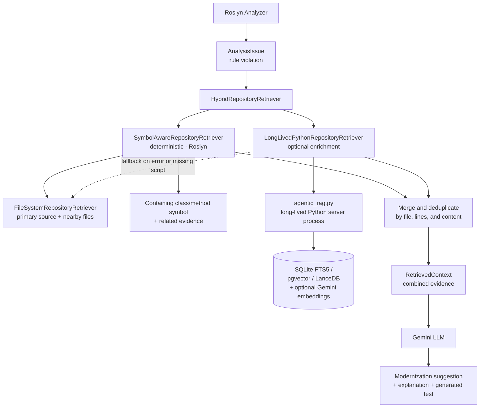

# Legacy Modernization Copilot

Legacy Modernization Copilot is a local-first developer tool that helps modernize older .NET code safely. It combines Roslyn-based code analysis, repository-aware retrieval, Gemini suggestions, generated tests, and automated verification in one workflow.

## The Problem

Modernizing a legacy codebase is usually slow and risky because developers must:
- find outdated patterns across a large project;
- understand the surrounding code before changing it;
- review whether an AI-generated change is appropriate; and
- prove that the original behavior still works after the change.

This project turns those steps into a repeatable, evidence-based pipeline.

## What The Demo Shows

1. Enter a `.csproj` path in the React interface.
2. Roslyn opens the project and detects modernization issues such as sync-over-async code, legacy HTTP APIs, and disposable-resource patterns.
3. The system retrieves the affected source file and relevant repository context.
4. Gemini proposes a refactoring and explains the reasoning.
5. Gemini generates a test for the finding.
6. If a test project is supplied, the verifier builds and tests the original and refactored versions.
7. The UI presents the issue, evidence, before/after code, test, and review decision.

## Simple Architecture

```mermaid
flowchart LR
  Developer[Developer] --> UI[React UI]
  UI --> API[ASP.NET Core API]
  API --> Analyze[1. Roslyn analysis]
  Analyze --> Retrieve[2. Repository evidence]
  Retrieve --> Suggest[3. Gemini suggestion]
  Suggest --> Test[4. Generate tests]
  Test --> Verify[5. Build and verify]
  Verify --> Result[Reviewable result]
```



### Core Responsibilities

| Layer | Responsibility |
|---|---|
| React + Vite | Project input, pipeline status, issue list, code comparison, and approve/reject review UI |
| ASP.NET Core | Coordinates the end-to-end pipeline and exposes REST endpoints |
| Roslyn Analyzer | Loads the `.NET` project and detects legacy coding patterns from syntax trees |
| RAG Layer | Retrieves source, symbols, nearby tests, lexical matches, and optional vector context |
| LLM Layer | Generates structured modernization suggestions using Gemini |
| Test Generator | Creates focused tests for detected issues |
| Verifier | Builds and runs tests; this is the authority for whether a suggestion is safe |
| SQLite | Stores local retrieval data and accepted refactoring history by default |

**Important design principle:** AI generation proposes a change; verification determines whether it is safe. A suggestion is never trusted only because a model produced it.

<!-- AI-GENERATED-START | user:gt130819 | date:2026-09-25 | model:Kimi K3 -->
### Retrieval Flow

Every issue found by the analyzer goes through a hybrid retrieval pipeline before anything is sent to the LLM. A deterministic Roslyn retriever always runs; an optional long-lived Python worker adds vector/lexical enrichment when available.



Key behaviors of the retrieval layer:

- `HybridRepositoryRetriever` runs both retrievers for every issue and merges the results, deduplicating by file path, line range, and content.
- `SymbolAwareRepositoryRetriever` wraps `FileSystemRepositoryRetriever` and enriches the primary source with the containing class/method symbol and related evidence discovered through Roslyn syntax trees.
- `LongLivedPythonRepositoryRetriever` keeps `python/agentic_rag.py --server` alive across requests and falls back to `FileSystemRepositoryRetriever` if Python is unavailable, times out, or returns an error — so retrieval never fails the pipeline.
<!-- AI-GENERATED-END | user:gt130819 | date:2026-09-25 -->

## Modernization Rules (LMC001-LMC006)

The Roslyn analyzer includes six deterministic rules, each covered by unit tests in `backend/src/LegacyModernization.Analyzer.Tests/`:

| Rule ID | Rule | Detects |
|---|---|---|
| `LMC001` | `SyncOverAsyncRule` | Blocking on async code (`.Result`, `.Wait()`, `GetAwaiter().GetResult()`) |
| `LMC002` | `WebClientRule` | Legacy `WebClient` usage instead of `HttpClient` |
| `LMC003` | `ConfigureAwaitRule` | Awaited calls missing `ConfigureAwait(false)` in library code |
| `LMC004` | `DisposePatternRule` | `IDisposable` resources not wrapped in `using` declarations |
| `LMC005` | `HttpClientInstantiationRule` | Direct `new HttpClient()` instead of `IHttpClientFactory` |
| `LMC006` | `DateTimeNowRule` | `DateTime.Now` instead of `DateTime.UtcNow` |

All rule implementations live in `backend/src/LegacyModernization.Analyzer/Rules/` and run through `PatternRuleEngine`.

## Technology Stack

- .NET 10 and ASP.NET Core
- Roslyn / MSBuild Workspace
- React 19, TypeScript, Vite, and Tailwind CSS
- SQLite and SQLite FTS5
- Python 3.11+ for the optional RAG worker and evaluation tools
- Gemini API for optional suggestion and embedding generation
- xUnit and `dotnet test` for verification

## Quick Start

### Prerequisites

- .NET 10 SDK
- Node.js and npm
- Python 3.11+ for the optional RAG tools
- Docker Desktop only for the container workflow

### 1. Configure Gemini

From the repository root:

```powershell
Copy-Item .env.example .env
```

Add your Gemini key to `.env`. It is required for the complete AI modernization workflow:

```env
GEMINI_API_KEY=your_gemini_api_key_here
```

Without a key, Roslyn analysis can still run, but AI suggestions and generated tests are not available. Results remain review-only and cannot be marked safe.

### 2. Start the Backend

```powershell
dotnet restore
dotnet build backend/src/LegacyModernization.Api/LegacyModernization.Api.csproj
dotnet run --project backend/src/LegacyModernization.Api/LegacyModernization.Api.csproj --launch-profile http
```

The API runs at `http://localhost:5198`. Interactive API documentation is available through Scalar.

### 3. Start the Frontend

In a second terminal:

```powershell
Set-Location frontend
npm install
npm run dev
```

Open `http://localhost:5173` and enter a project path such as:

```text
samples/LegacySampleProject/LegacySampleProject.csproj
```

To enable verification, also provide:

```text
samples/LegacySampleProject.Tests/LegacySampleProject.Tests.csproj
```

## API Surface

| Endpoint | Purpose |
|---|---|
| `POST /api/analysis` | Analyze a project with Roslyn |
| `POST /api/suggestions` | Retrieve evidence and generate suggestions |
| `POST /api/testgeneration` | Generate tests for findings |
| `POST /api/verification` | Verify a test project |
| `POST /api/pipeline` | Run the complete workflow |

Example complete-pipeline request:

```json
{
  "projectPath": "samples/LegacySampleProject/LegacySampleProject.csproj",
  "testProjectPath": "samples/LegacySampleProject.Tests/LegacySampleProject.Tests.csproj"
}
```

## Configuration

These variables are read from the environment or the local `.env` file loaded at startup.

<!-- AI-GENERATED-START | user:gt130819 | date:2026-09-25 | model:Kimi K3 -->
| Variable | Default | Purpose |
|---|---|---|
| `GEMINI_API_KEY` | required for full workflow | Enables Gemini suggestions and generated tests |
| `GEMINI_MODEL` | `gemini-3.8-flash` | Gemini model used for suggestions and test generation |
| `GEMINI_TIMEOUT_SECONDS` | `20` (clamped 5-300) | Timeout for Gemini API calls |
| `RAG_STORE_MODE` | `sqlite` | Retrieval store: `sqlite`, `pgvector`, `lancedb`, or `allow-fallback` |
| `RAG_SQLITE_PATH` | `./.legacy_rag.sqlite3` | SQLite database location |
| `RAG_LANCEDB_PATH` | `./.lancedb` | LanceDB database location (when `RAG_STORE_MODE=lancedb`) |
| `RAG_EMBEDDING_PROVIDER` | `none` | Keeps the default path lexical and local |
| `RAG_EMBEDDING_MODEL` | `gemini-embedding-001` | Embedding model metadata |
| `RAG_EMBEDDING_DIM` | `768` | Embedding vector dimension |
| `RAG_INDEX_VERSION` | `1` | Retrieval index compatibility version |
| `PYTHON` | `python` | Python executable used by the long-lived retrieval worker |
| `RAG_PYTHON_TIMEOUT_SECONDS` | `5` | Per-query timeout for the Python retrieval worker |
| `RAG_PYTHON_MAX_OUTPUT_BYTES` | `1048576` | Maximum response size accepted from the Python worker |
<!-- AI-GENERATED-END | user:gt130819 | date:2026-09-25 -->

## Validation

<!-- AI-GENERATED-START | user:gt130819 | date:2026-09-25 | model:Kimi K3 -->
Run the analyzer rule tests:

```powershell
dotnet test backend/src/LegacyModernization.Analyzer.Tests/LegacyModernization.Analyzer.Tests.csproj
```
<!-- AI-GENERATED-END | user:gt130819 | date:2026-09-25 -->

Run the backend RAG tests:
```powershell
dotnet test backend/tests/LegacyModernization.Rag.Tests/LegacyModernization.Rag.Tests.csproj
```

Run the Python tests:

```powershell
python -m pytest python/tests -q
```

Build the frontend:

```powershell
Set-Location frontend
npm run build
```

Run the local retrieval evaluation:

```powershell
python python/evaluate_rag.py `
  --repo-root samples/LegacySampleProject `
  --dataset python/tests/fixtures/retrieval-golden.jsonl `
  --output reports/rag-eval-report.json
```

## Project Structure

```text
backend/src/
  LegacyModernization.Analyzer/       Roslyn analysis and modernization rules
  LegacyModernization.Api/            ASP.NET Core API and pipeline orchestration
  LegacyModernization.Core/           Shared models and contracts
  LegacyModernization.LLM/            Optional structured Gemini integration
  LegacyModernization.Rag/            Retrieval, SQLite, FTS5, and indexing
  LegacyModernization.TestGenerator/  Generated test creation
  LegacyModernization.Verifier/       Build, test, and behavior verification
<!-- AI-GENERATED-START | user:gt130819 | date:2026-09-25 | model:Kimi K3 -->
  LegacyModernization.Analyzer.Tests/ Unit tests for the six modernization rules
backend/tests/
  LegacyModernization.Rag.Tests/      Retrieval, indexing, and store tests
tools/AnalyzerHost/                   Console host that runs analysis and writes reports/
generated-tests/                      Output location for generated test files
<!-- AI-GENERATED-END | user:gt130819 | date:2026-09-25 -->
frontend/                              React + Vite review interface
python/                                Optional RAG worker and evaluation tools
samples/                               Legacy and refactored demonstration projects
reports/                               Analysis and evaluation output
docs/                                  Detailed RAG implementation plan
```

## Interview Summary

> Legacy Modernization Copilot is an evidence-first .NET modernization assistant. Roslyn identifies risky legacy patterns, the retrieval layer supplies repository context, Gemini proposes a refactoring, and generated tests plus a verifier provide the safety gate. The result is a reviewable change rather than an unverified AI rewrite.

## Design Trade-offs

- **Local-first over cloud-first:** reduces setup, cost, and data movement for an initial developer workflow.
- **Deterministic evidence over semantic search alone:** keeps suggestions grounded in the target repository.
- **Human review over automatic patching:** the application displays proposed changes and does not silently modify source code.
- **Verification over model confidence:** only test results can establish that a suggestion is safe.

## Docker

Docker Desktop is optional:

```powershell
docker compose up --build
```

The frontend is exposed at `http://localhost:5173` and the backend at `http://localhost:5198`.

## Further Reading

See [docs/rag-implementation-plan.md](docs/rag-implementation-plan.md) for the detailed retrieval architecture, contracts, guardrails, and evaluation plan.
