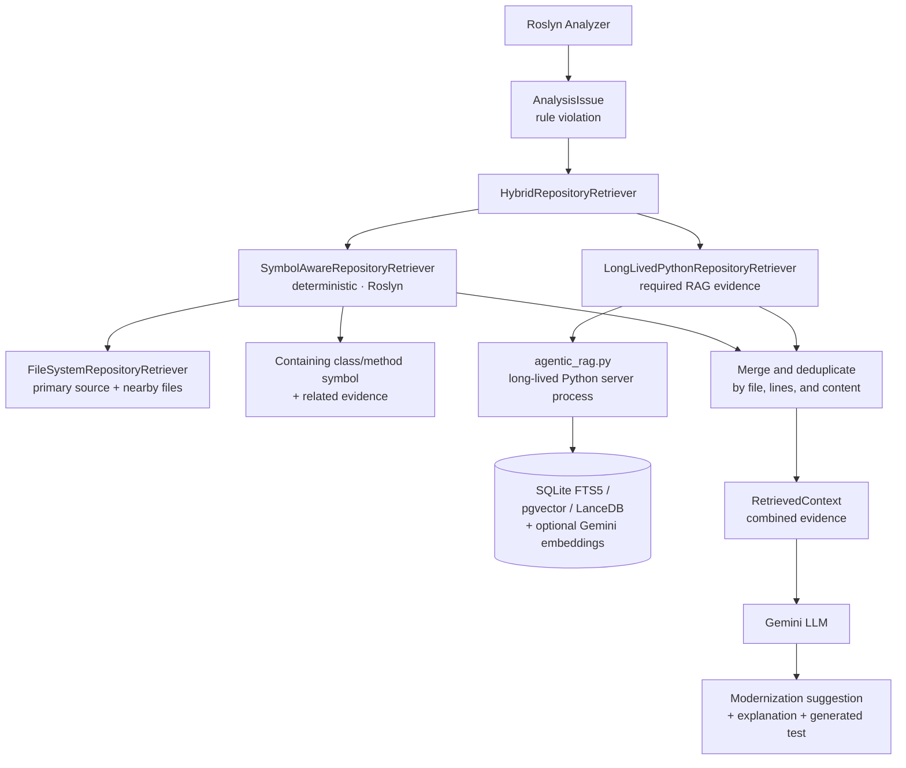

# Legacy Modernization Copilot

Legacy Modernization Copilot is a local-first developer tool that helps modernize older .NET code safely. It combines Roslyn-based code analysis, repository-aware retrieval, Gemini suggestions, generated tests, and automated verification in one workflow.

## The Problem

Modernizing a legacy codebase is usually slow and risky because developers must:
- find outdated patterns across a large project;
- understand the surrounding code before changing it;
- review whether an AI-generated change is appropriate; and
- prove that the original behavior still works after the change.

This project turns those steps into a repeatable, evidence-based pipeline.

## What The Demo Shows

1. Enter a `.csproj` path in the React interface.
2. Roslyn opens the project and detects modernization issues such as sync-over-async code, legacy HTTP APIs, and disposable-resource patterns.
3. The system retrieves the affected source file and relevant repository context.
4. Gemini proposes a refactoring and explains the reasoning.
5. Gemini generates a test for the finding.
6. If a test project is supplied, the verifier builds and tests the original and refactored versions.
7. The UI presents the issue, evidence, before/after code, generated test, and review decision. Accept applies a guarded source edit; Reject records the decision without changing code.

Generated test code is included in the pipeline response either way. When `TestProjectPath` is supplied, the pipeline writes non-empty generated test files into that test project's directory and runs verification. Without it, tests are returned for review but are not written to disk or run. `POST /api/testgeneration` also returns tests without writing them to a test project.

## Simple Architecture


```mermaid
flowchart LR
  Developer[Developer] --> UI[React UI]
  UI --> API[ASP.NET Core API]
  API --> Analyze[1. Roslyn analysis]
  Analyze --> Retrieve[2. Repository evidence]
  Retrieve --> Suggest[3. Gemini suggestion]
  Suggest --> Test[4. Generate tests]
  Test --> Verify[5. Build and verify]
  Verify --> Result[Reviewable result]
```

### Core Responsibilities

| Layer | Responsibility |
|---|---|
| React + Vite | Project input, pipeline status, issue list, code comparison, and approve/reject review UI |
| ASP.NET Core | Coordinates the end-to-end pipeline and exposes REST endpoints |
| Roslyn Analyzer | Loads the `.NET` project and detects legacy coding patterns from syntax trees |
| RAG Layer | Required hybrid retrieval: Roslyn-derived repository context plus Python lexical/vector enrichment |
| LLM Layer | Generates structured modernization suggestions using Gemini |
| Test Generator | Creates focused tests for detected issues |
| Verifier | Builds and runs tests; this is the authority for whether a suggestion is safe |
| SQLite | Stores local retrieval data, review decisions, and verified accepted-refactoring history by default |

**Important design principle:** AI generation proposes a change; verification determines whether it is safe. A suggestion is never trusted only because a model produced it.

<!-- AI-GENERATED-START | user:gt130819 | date:2026-09-25 | model:Kimi K3 -->
### Retrieval Flow

Every issue found by the analyzer goes through a hybrid retrieval pipeline before anything is sent to the LLM. Deterministic Roslyn retrieval supplies source and symbol context, while the long-lived Python RAG worker must also return usable evidence. If Python RAG is unavailable or returns no usable evidence, generation reports a retrieval error instead of continuing with Roslyn-only context.


```mermaid
flowchart TD
  Analyzer[Roslyn Analyzer] --> Issue[AnalysisIssue<br/>rule violation]
  Issue --> Hybrid[HybridRepositoryRetriever]

  Hybrid --> Symbol[SymbolAwareRepositoryRetriever<br/>deterministic · Roslyn]
  Hybrid --> Python[LongLivedPythonRepositoryRetriever<br/>required RAG evidence]

  Symbol --> FS[FileSystemRepositoryRetriever<br/>primary source + nearby files]
  Symbol --> Symbols[Containing class/method symbol<br/>+ related evidence]

  Python --> Agent[agentic_rag.py<br/>long-lived Python server process]
  Agent --> Stores[(SQLite FTS5 /<br/>pgvector / LanceDB<br/>+ optional Gemini embeddings)]
  Symbol --> Merge[Merge and deduplicate<br/>by file, lines, and content]
  Python --> Merge

  Merge --> Context[RetrievedContext<br/>combined evidence]
  Context --> LLM[Gemini LLM]
  LLM --> Suggestion[Modernization suggestion<br/>+ explanation + generated test]
```

Key behaviors of the retrieval layer:

- `HybridRepositoryRetriever` runs both retrievers for every issue and merges the results, deduplicating by file path, line range, and content.
- `SymbolAwareRepositoryRetriever` wraps `FileSystemRepositoryRetriever` and enriches the primary source with the containing class/method symbol and related evidence discovered through Roslyn syntax trees.
- `LongLivedPythonRepositoryRetriever` keeps `python/agentic_rag.py --server` alive across requests. Missing scripts, worker failures, and empty RAG evidence fail retrieval; there is no filesystem-only fallback.
- The worker returns evidence only; it does not make a second Gemini completion for each context query. Standalone Python CLI queries still generate an answer.
- SQLite skips embedding unchanged chunks and prunes common generated/build directories (including `bin`, `obj`, `node_modules`, `.venv`, and `dist`) during indexing. First-time indexing can still take longer, especially when Gemini embeddings are enabled.
<!-- AI-GENERATED-END | user:gt130819 | date:2026-09-25 -->

## Modernization Rules (LMC001-LMC006)

The Roslyn analyzer includes six deterministic rules, each covered by unit tests in `backend/src/LegacyModernization.Analyzer.Tests/`:

| Rule ID | Rule | Detects |
|---|---|---|
| `LMC001` | `SyncOverAsyncRule` | Blocking on async code (`.Result`, `.Wait()`, `GetAwaiter().GetResult()`) |
| `LMC002` | `WebClientRule` | Legacy `WebClient` usage instead of `HttpClient` |
| `LMC003` | `ConfigureAwaitRule` | Awaited calls missing `ConfigureAwait(false)` in library code |
| `LMC004` | `DisposePatternRule` | `IDisposable` resources not wrapped in `using` declarations |
| `LMC005` | `HttpClientInstantiationRule` | Direct `new HttpClient()` instead of `IHttpClientFactory` |
| `LMC006` | `DateTimeNowRule` | `DateTime.Now` instead of `DateTime.UtcNow` |

All rule implementations live in `backend/src/LegacyModernization.Analyzer/Rules/` and run through `PatternRuleEngine`.

## Technology Stack

- .NET 10 and ASP.NET Core
- Roslyn / MSBuild Workspace
- React 19, TypeScript, Vite, and Tailwind CSS
- SQLite and SQLite FTS5
- Python 3.11+ and packages in `python/requirements.txt` for required retrieval
- Gemini API for optional suggestion and embedding generation
- xUnit and `dotnet test` for verification

## Quick Start

### Prerequisites

- .NET 10 SDK
- Node.js and npm
- Python 3.11+ with the retrieval dependencies installed
- Docker Desktop only for the container workflow

### 1. Configure Gemini

From the repository root:

```powershell
Copy-Item .env.example .env
```

Add your Gemini key to `.env`. It is required for the complete AI modernization workflow:

```env
GEMINI_API_KEY=your_gemini_api_key_here
```

Install the Python retrieval dependencies from the repository root:

```powershell
python -m pip install -r python/requirements.txt
```

Python RAG is required for suggestions and generated tests. Without a working Python runtime and its dependencies, Roslyn analysis can still run, but retrieval-dependent generation returns an error rather than silently using Roslyn-only evidence. Without a Gemini key, model suggestions and tests cannot be generated.

### 2. Start the Backend

```powershell
dotnet restore
dotnet build backend/src/LegacyModernization.Api/LegacyModernization.Api.csproj
dotnet run --project backend/src/LegacyModernization.Api/LegacyModernization.Api.csproj --launch-profile http
```

The API runs at `http://localhost:5198`. Interactive API documentation is available through Scalar.

### 3. Start the Frontend

In a second terminal:

```powershell
Set-Location frontend
npm install
npm run dev
```

Open `http://localhost:5173` and enter a project path such as:

```text
samples/LegacySampleProject/LegacySampleProject.csproj
```

To enable verification, also provide:

```text
samples/LegacySampleProject.Tests/LegacySampleProject.Tests.csproj
```

## API Surface

| Endpoint | Purpose |
|---|---|
| `POST /api/analysis` | Analyze a project with Roslyn |
| `POST /api/suggestions` | Retrieve evidence and generate suggestions |
| `POST /api/testgeneration` | Generate tests for findings |
| `POST /api/verification` | Verify a test project |
| `POST /api/pipeline` | Run the complete workflow |
| `POST /api/review` | Persist an `approved`, `rejected`, or `pending` decision; approval applies the suggested source edit |

Example complete-pipeline request:

```json
{
  "projectPath": "samples/LegacySampleProject/LegacySampleProject.csproj",
  "testProjectPath": "samples/LegacySampleProject.Tests/LegacySampleProject.Tests.csproj"
}
```

### Review Decisions

The Issue Detail page sends Accept, Reject, and Reset actions to `POST /api/review`. Decisions are stored in the local SQLite database and restored when the pipeline is run again.

- **Accept & Apply** replaces the issue's original code snippet in its source file. The source file must be inside the analyzed project, the original snippet must match exactly once, and the replacement must not increase C# syntax errors. The endpoint refuses stale, ambiguous, empty, or syntactically invalid edits.
- **Reject** stores the rejection and does not modify source code.
- **Reset** returns a rejected decision to pending. After acceptance, Reset restores the original snippet only if the applied replacement is still present exactly once; otherwise it refuses to overwrite intervening edits.

Acceptance is a user decision, not proof that a change is safe. Applying a suggestion does not automatically run tests. Supply a test project path to the pipeline for its verification step, and review the verification result separately.

## Configuration

These variables are read from the environment or the local `.env` file loaded at startup.

<!-- AI-GENERATED-START | user:gt130819 | date:2026-09-25 | model:Kimi K3 -->
| Variable | Default | Purpose |
|---|---|---|
| `GEMINI_API_KEY` | required for full workflow | Enables Gemini suggestions and generated tests |
| `GEMINI_MODEL` | `gemini-3.8-flash` | Gemini model used for suggestions and test generation |
| `GEMINI_TIMEOUT_SECONDS` | `60` (clamped 5-300) | Timeout for Gemini API calls |
| `RAG_STORE_MODE` | `sqlite` | Python RAG store: `sqlite`, `pgvector`, `lancedb`, or `allow-fallback` |
| `RAG_SQLITE_PATH` | `./.legacy_rag.sqlite3` | SQLite database location |
| `RAG_LANCEDB_PATH` | `./.lancedb` | LanceDB database location (when `RAG_STORE_MODE=lancedb`) |
| `RAG_EMBEDDING_PROVIDER` | `none` | Keeps the default path lexical and local |
| `RAG_EMBEDDING_MODEL` | `gemini-embedding-001` | Embedding model metadata |
| `RAG_EMBEDDING_DIM` | `768` | Embedding vector dimension |
| `RAG_INDEX_VERSION` | `1` | Retrieval index compatibility version |
| `PYTHON` | `python` | Python executable used by the long-lived retrieval worker |
| `RAG_PYTHON_TIMEOUT_SECONDS` | `5` | Per-query timeout for the Python retrieval worker |
| `RAG_PYTHON_MAX_OUTPUT_BYTES` | `1048576` | Maximum response size accepted from the Python worker |
<!-- AI-GENERATED-END | user:gt130819 | date:2026-09-25 -->

## Validation

<!-- AI-GENERATED-START | user:gt130819 | date:2026-09-25 | model:Kimi K3 -->
Run the analyzer rule tests:

```powershell
dotnet test backend/src/LegacyModernization.Analyzer.Tests/LegacyModernization.Analyzer.Tests.csproj
```
<!-- AI-GENERATED-END | user:gt130819 | date:2026-09-25 -->

Run the backend RAG tests:
```powershell
dotnet test backend/tests/LegacyModernization.Rag.Tests/LegacyModernization.Rag.Tests.csproj
```

Run API review workflow tests:

```powershell
dotnet test backend/tests/LegacyModernization.Api.Tests/LegacyModernization.Api.Tests.csproj
```

Run the Python tests:

```powershell
python -m pytest python/tests -q
```

Build the frontend:

```powershell
Set-Location frontend
npm run build
```

Run the local retrieval evaluation:

```powershell
python python/evaluate_rag.py `
  --repo-root samples/LegacySampleProject `
  --dataset python/tests/fixtures/retrieval-golden.jsonl `
  --output reports/rag-eval-report.json
```

## Project Structure

```text
backend/src/
  LegacyModernization.Analyzer/       Roslyn analysis and modernization rules
  LegacyModernization.Api/            ASP.NET Core API and pipeline orchestration
  LegacyModernization.Core/           Shared models and contracts
  LegacyModernization.LLM/            Optional structured Gemini integration
  LegacyModernization.Rag/            Retrieval, SQLite, FTS5, and indexing
  LegacyModernization.TestGenerator/  Generated test creation
  LegacyModernization.Verifier/       Build, test, and behavior verification
<!-- AI-GENERATED-START | user:gt130819 | date:2026-09-25 | model:Kimi K3 -->
  LegacyModernization.Analyzer.Tests/ Unit tests for the six modernization rules
backend/tests/
  LegacyModernization.Rag.Tests/      Retrieval, indexing, and store tests
  LegacyModernization.Api.Tests/      Accept, reject, reset, and guarded source-edit tests
tools/AnalyzerHost/                   Console host that runs analysis and writes reports/
generated-tests/                      Output location for generated test files
<!-- AI-GENERATED-END | user:gt130819 | date:2026-09-25 -->
frontend/                              React + Vite review interface
python/                                Retrieval worker and evaluation tools
samples/                               Legacy and refactored demonstration projects
reports/                               Analysis and evaluation output
docs/                                  Detailed RAG implementation plan
```

## Design Trade-offs

- **Local-first over cloud-first:** reduces setup, cost, and data movement for an initial developer workflow.
- **Deterministic evidence over semantic search alone:** keeps suggestions grounded in the target repository.
- **Explicit review over silent patching:** source changes happen only after Accept & Apply, with exact-match and syntax-error guards; Reject never modifies source code.
- **Verification over model confidence:** only test results can establish that a suggestion is safe.

## Docker

Docker Desktop is optional:

```powershell
docker compose up --build
```

The frontend is exposed at `http://localhost:5173` and the backend at `http://localhost:5198`.

## Further Reading

See [docs/rag-implementation-plan.md](docs/rag-implementation-plan.md) for the detailed retrieval architecture, contracts, guardrails, and evaluation plan.
