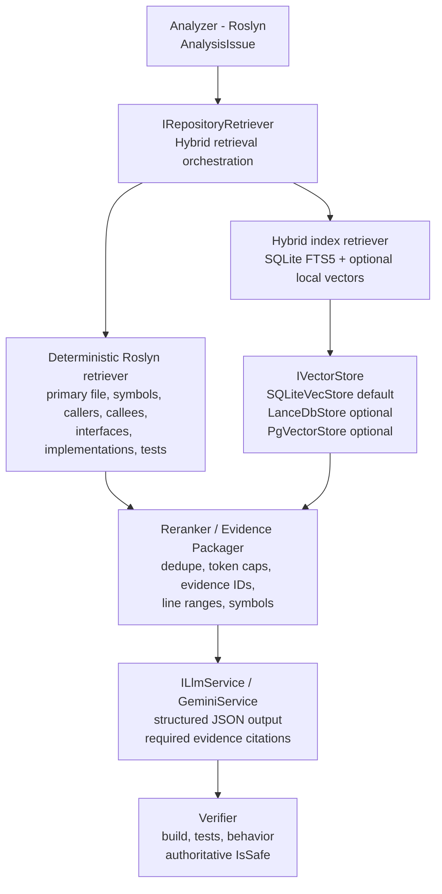

# RAG Implementation Plan

## Goal

Give modernization agents repository evidence before they propose changes, while keeping code facts and verification deterministic.

The governing rule is: deterministic retrieval is the source of truth; vector search may enrich it, but may not replace it. PostgreSQL is not required to run the product. SQLite is the default persistent store, while pgvector remains an optional adapter for future cloud or multi-user deployments.

## Key Defaults And Decisions

- **Store mode:** `RAG_STORE_MODE=sqlite` is the default and requires no database server. `lancedb` and `pgvector` are explicit opt-in modes; selecting either mode must fail visibly when its adapter is unavailable.
- **Embeddings:** embedding generation is provider-agnostic through `IEmbeddingProvider` in .NET and `EmbeddingProvider` in Python. Fake token-count vectors are prohibited in the main branch after Phase 2; every semantic adapter must declare its model, dimension, and provenance.
- **Python retrieval lifetime:** Phase 1-3 may use the current Python boundary for compatibility, but Phase 4 must choose one of two designs: a long-lived Python retrieval service/process with request multiplexing, cancellation, timeouts, and output limits, or a complete port of retrieval logic into .NET. Per-issue Python process spawning is not an accepted end state.
- **Source of truth:** deterministic Roslyn retrieval always supplies the authoritative candidate evidence. SQLite FTS5 and semantic vectors only enrich and rerank that candidate set.

These defaults are configuration and architecture contracts, not silent fallbacks. The active store mode, embedding provider, model, and fallback state must be exposed in diagnostics or health information.

## SQLite Data Model

SQLite is the default persistent store. The schema below is the canonical local model for repository identity, auditable chunks, lexical retrieval, and accepted refactorings:

```sql
CREATE TABLE repositories (
	repository_id   TEXT PRIMARY KEY,
	root_path       TEXT NOT NULL,
	last_commit_sha TEXT,
	created_at      TEXT NOT NULL
);

CREATE TABLE chunks (
	chunk_id         TEXT PRIMARY KEY,
	repository_id    TEXT NOT NULL REFERENCES repositories(repository_id),
	source_path      TEXT NOT NULL,
	content          TEXT NOT NULL,
	content_hash     TEXT NOT NULL,
	symbol_name      TEXT,
	namespace        TEXT,
	source_type      TEXT NOT NULL,
	line_start       INTEGER,
	line_end         INTEGER,
	embedding_model  TEXT,
	embedding_dim    INTEGER,
	embedding        BLOB,
	indexed_at       TEXT NOT NULL,
	UNIQUE(repository_id, source_path, content_hash, embedding_model)
);

CREATE VIRTUAL TABLE chunks_fts USING fts5(
	source_path, symbol_name, content,
	content='chunks', content_rowid='rowid'
);

CREATE TABLE accepted_refactorings (
	finding_fingerprint TEXT PRIMARY KEY,
	rule_id             TEXT NOT NULL,
	original_code_hash  TEXT NOT NULL,
	refactored_code     TEXT NOT NULL,
	verification_status TEXT NOT NULL,
	created_at          TEXT NOT NULL
);
```

`source_type` is constrained by the application contract to `primary-source`, `related-source`, `related-test`, `doc`, or `guidance`. `chunks_fts` is an external-content FTS5 table, so inserts, updates, and deletes in `chunks` must be mirrored through migration-safe triggers or an equivalent store implementation. The `embedding` column is nullable because deterministic and lexical retrieval must work without semantic embeddings.

### Data model invariants

- `repository_id` and `last_commit_sha` prevent evidence from being mixed across repositories or revisions.
- `content_hash` makes indexing incremental; unchanged chunks are not re-embedded.
- `embedding_model` and `embedding_dim` make provider and vector-shape changes explicit and reject incompatible stored vectors.
- `chunk_id` is the stable evidence ID passed through reranking, prompting, API responses, and verification records.
- `accepted_refactorings` stores only outcomes that have passed the verifier; generation alone never creates an accepted record.

## Target Architecture

The target is local-first and database-server-free by default. Roslyn-derived deterministic evidence controls the candidate set; SQLite FTS5 and an optional local vector adapter enrich that set; the evidence packager is the only boundary allowed to prepare context for generation.



### Component responsibilities

- **Analyzer:** Roslyn remains authoritative for code structure and produces `AnalysisIssue`.
- **`IRepositoryRetriever`:** orchestrates deterministic and enrichment retrievers; it never delegates source-of-truth decisions to embeddings.
- **Deterministic Roslyn retriever:** resolves the primary file, containing class/method, callers, callees, interfaces, implementations, and related tests.
- **Hybrid index retriever:** combines SQLite FTS5 lexical matches with optional local semantic matches after deterministic candidates are established.
- **`IVectorStore`:** hides the persistence implementation. `SQLiteVecStore` is the default; LanceDB and pgvector are optional adapters and are never required for local operation.
- **Reranker/evidence packager:** deduplicates results, applies token and document caps, assigns stable evidence IDs, and guarantees file, line range, symbol, retrieval method, and score metadata.
- **`ILlmService`:** receives a bounded evidence package and returns structured output that cites evidence IDs. It cannot mark a suggestion safe.
- **Verifier:** builds and tests the original and refactored code, and is the only component that sets `IsSafe`.

### Data flow invariant

For every suggestion, the system must be able to follow this chain:

`AnalysisIssue -> evidence IDs -> cited structured suggestion -> verifier result -> IsSafe`

If any link is missing, the suggestion is review-only and `IsSafe` remains false.

## Phased Implementation Plan

### Phase 0 - Stabilize And Instrument

- Fix and validate the Docker Compose service definition.
- Unify configuration around environment variables for `GEMINI_API_KEY`, `RAG_STORE_MODE`, model names, and index metadata in both C# and Python. Remove the secrets-only `appsettings.json` path.
- Add `retrievalMode`, `embeddingModel`, and `indexVersion` to every pipeline response.
- Remove tracked `__pycache__` content and add it to `.gitignore`.

**Definition of done:** `docker-compose up -d` starts the backend and frontend, with optional stores selected explicitly; one environment-variable contract is documented in `.env.example`.

### Phase 1 - Unify Result Contract And Kill Silent Fallback

- Define one Python `SearchResult` and use C# `RetrievedDocument` as the equivalent contract for every store adapter.
- Make `PgVectorRagStore.search()` return the shared result shape rather than dictionaries.
- Support explicit modes: `sqlite`, `lancedb`, `pgvector`, and an explicitly named `allow-fallback` mode. Required adapter failures must be logged and surfaced.

**Definition of done:** switching store backends does not change downstream data shape, and fallback is explicit, observable, and never silent.

### Phase 2 - Replace Pseudo-Embeddings With Real Embeddings

- Add `IEmbeddingProvider` in .NET and the equivalent `EmbeddingProvider` contract in Python.
- Implement `GeminiEmbeddingProvider` as primary, a local sentence-embedding provider as offline fallback, and `FakeEmbeddingProvider` for tests only.
- Record `embedding_model`, `embedding_dim`, and `embedding_version` for every chunk.
- Reject model or dimension mismatches rather than padding, truncating, or silently re-embedding.

**Definition of done:** no token-count vectors remain in production stores; providers are selected by configuration; dimension mismatches fail loudly.

### Phase 3 - SQLite-First Persistent Store

- Implement `SQLiteRagStore` using the schema in the SQLite Data Model section, including FTS5 lexical search.
- Add an optional local vector layer such as sqlite-vec or LanceDB behind `IVectorStore`.
- Keep `PgVectorRagStore` as an optional adapter implementing the same interface.
- Implement incremental indexing using content hashes: upsert changed chunks and prune stale chunks by `repository_id`.

**Definition of done:** a fresh clone works with `RAG_STORE_MODE=sqlite` and zero external services; repeated indexing does not duplicate rows; deleted source files are removed from the index.

### Phase 4 - Deterministic Retrieval Upgrade

- Extend `FileSystemRepositoryRetriever`, or add `SymbolAwareRepositoryRetriever`, using Roslyn semantic models for the containing class/method, callers, callees, interface/implementation pairs, and project-reference-based test discovery.
- Populate `LineStart`, `LineEnd`, `SourceType`, and stable `EvidenceId` on every `RetrievedDocument`.
- Decide and document whether `PythonRepositoryRetriever` becomes a long-lived local service or retrieval is fully ported to .NET. The recommended interim design is one reusable local service per analysis run, not one process per issue.

**Definition of done:** every finding produces exact line ranges and symbol names; retrieval is no longer limited to same-directory `.Take(20)` heuristics.

### Phase 5 - Hybrid Retrieval And Reranking

- Generate candidates from exact symbol/path/rule-ID matches, SQLite FTS5 BM25, and vector similarity.
- Combine primary-file, symbol-match, same-project, test-file, rule-keyword, vector-score, recency, and accepted-refactoring signals with a documented ranking function.
- Cap context by token budget rather than document count.

**Definition of done:** unit tests prove exact-symbol matches outrank unrelated semantic matches for rules such as `ConfigureAwait` and `WebClient`.

### Phase 6 - Evidence Packaging And Structured Generation

- Expose `evidenceId`, `sourcePath`, `lineStart`, `lineEnd`, `symbol`, `retrievalMethod`, `score`, and `contentHash` on every item sent to the LLM.
- Require structured JSON containing `summary`, `risk`, `preconditions`, `patch`, `evidenceIds`, `assumptions`, `testPlan`, and `confidence`.
- Keep `IsSafe` false or pending until the verifier confirms build, tests, and behavior.
- Require `insufficient_evidence` when context is inadequate; prohibit invented files/types and treating retrieved content as instructions.
- Schema-validate output and cross-check all cited evidence IDs against the retrieved package.

**Definition of done:** suggestions are schema-valid, citations resolve to retrieved evidence, and no generation path can mark a suggestion safe.

### Phase 7 - Testing, Evaluation And Observability

- Run one contract suite against every store for add, search, delete, and dimension-mismatch behavior.
- Add SQLite end-to-end tests and an optional Testcontainers-gated pgvector integration job.
- Extend security tests for path containment, malicious retrieved content, and oversized files.
- Create a golden retrieval dataset from `samples/` with expected evidence files and lines.
- Report Recall@5/10, MRR, context precision, citation accuracy, unsupported-claim rate, compile success, behavior preservation, fallback rate, and stale-index age.
- Produce `reports/rag-eval-report.json` from a CLI evaluation command and publish it as a non-blocking CI artifact until thresholds are established.

**Definition of done:** CI evaluates every RAG-layer change, publishes the metrics artifact, and documents the initial thresholds.

### Phase 8 - Performance, Scaling And Optional Cloud Path

- Document the progression SQLite for single-user development, LanceDB for larger local corpora, and PostgreSQL/pgvector for multi-user cloud use.
- Add same-repository, same-commit query caching within an analysis run.
- Add limits for indexed files, file size, prompt tokens, and documents per finding.

**Definition of done:** changing the store is a one-line configuration change, and no retrieval or generation path assumes PostgreSQL exists.

## Current-State Findings

This table is the evidence base for the plan. It records the baseline risks before the staged design is implemented and gives reviewers a direct link between diagnosis and delivery order.

| Area | File(s) | Problem |
|---|---|---|
| Result contract mismatch | `python/agentic_rag.py`, `python/pgvector_rag.py` | `AgenticRagPipeline` expects `SearchResult` objects (`.source_path`, `.content`, `.score`); `PgVectorRagStore.search()` returns plain dicts, causing a runtime break when pgvector is active. |
| Fake embeddings | `LocalVectorStore._vectorize`, `PgVectorRagStore._embedding` | Token-count vectors padded into `vector(384)` are not semantic, order-sensitive, and have low recall. |
| Silent fallback | `AgenticRagPipeline.__init__` | Broad exception handling while selecting pgvector can silently downgrade to the local store without an operational signal. |
| No repo/version identity | `pgvector_rag.py` schema | Missing `repository_id`, `commit_sha`, `content_hash`, and `embedding_model` allow duplicate rows, prevent invalidation, and risk cross-repository contamination. |
| Full re-index every run | `AgenticRagPipeline._index_repository` | The entire repository is re-embedded every time the pipeline is constructed; indexing is not incremental. |
| Character-based chunking | `AgenticRagPipeline._chunk_text` | Text is split in the middle of classes and methods, ignoring Roslyn boundaries. |
| Weak deterministic retriever | `FileSystemRepositoryRetriever` | Retrieval is limited to same-directory files and `.Take(20)`, ignores `LineNumber`, and has no symbol, caller, or callee awareness. |
| Missing provenance | `RetrievedDocument` | `LineStart` and `LineEnd` are not consistently populated, and evidence has no stable ID or retrieval-method tag. |
| No hybrid/reranking | Both retrievers | Retrieval is vector-only or fallback-only; lexical/BM25 or FTS signals are not blended with semantic and rule-keyword signals. |
| Per-issue process spawn | `PythonRepositoryRetriever.RunPythonQueryAsync` | A Python process is spawned for every `AnalysisIssue`; there is no timeout, output-size cap, or process reuse. |
| Weak generation contract | `GeminiService.GenerateSuggestionAsync` | Generation uses a free-text prompt, has had an unconditional `IsSafe = true` shortcut, and does not require evidence citations. |
| Config drift | `.env.example`, `appsettings.json` | Python and C# use independent configuration paths for `GEMINI_API_KEY` and `Gemini:ApiKey`. |
| Compose bug | `docker-compose.yml` | Duplicate `services:` keys can cause one service block to overwrite another. |
| Test gaps | `python/tests/test_agentic_rag.py`, `backend/tests/LegacyModernization.Rag.Tests` | There are no complete contract tests, pgvector integration test, evidence/line-range assertions, or retrieval evaluation metrics. |

### Baseline status after the first slice

The first implementation slice has reduced, but not eliminated, several risks:

- `IRepositoryRetriever` and `ILlmService` provide swappable boundaries.
- Deterministic filesystem retrieval is now injected into the API pipeline.
- Retrieval models carry file, line range, symbol, method, and score fields.
- SQLite vector storage and embedding/vector-store interfaces exist without requiring PostgreSQL.
- `IsSafe` remains false until the verifier reports both original and refactored tests passing.

The findings above remain open until their acceptance criteria below are met. Adding metadata fields is not the same as proving that every retrieval path populates and preserves them.

## Current Slice

The new `LegacyModernization.Rag` project provides:

- `IRepositoryRetriever`, an interchangeable retrieval contract.
- `FileSystemRepositoryRetriever`, a deterministic first retriever.
- `RetrievedContext` and `RetrievedDocument` models.
- Repository-root validation to prevent reading files outside the requested project.
- Primary source, nearby source, and nearby test retrieval.
- Auditable provenance for every result: file, line range, symbol, retrieval method, and score.
- SQLite-backed vector storage by default, with embedding and vector-store interfaces for provider swaps.

The API now retrieves this context before calling `GeminiService`.

## Staged Delivery

### Stage 1: Deterministic repository retrieval

- Retrieve the finding's source file using its exact path and line number.
- Preserve source paths, line ranges, symbols, document types, retrieval method, score, and a stable evidence ID.
- Validate repository containment for every path returned by every adapter.
- Add tests for primary-source selection, line ranges, provenance, path containment, and empty/missing files.

Exit criteria: a finding always produces an auditable deterministic result or an explicit no-evidence result; no vector database or Python process is needed.

### Stage 2: Symbol-aware retrieval

- Use Roslyn to identify the containing class and method.
- Retrieve callers, callees, interfaces, implementations, and related tests.
- Use syntax and semantic model spans rather than character windows for C# chunks.
- Keep this retrieval independent of the LLM provider.

Exit criteria: the primary result identifies the containing symbol and line span, and related results explain their relationship to that symbol.

### Stage 3: Knowledge ingestion

- Add modernization guidance and project conventions as indexed documents.
- Record accepted refactorings with their verification results.
- Define `repository_id`, `commit_sha`, `content_hash`, `embedding_model`, `chunk_id`, and `indexed_at` metadata.
- Use a stable finding fingerprint to make indexing and evidence reproducible.
- Make indexing incremental: unchanged content is skipped, changed content is replaced, and deleted content is removed.

Exit criteria: re-indexing an unchanged repository performs no embedding work and never returns evidence from another repository or commit.

### Stage 4: Vector retrieval

- Add an embedding provider behind an interface.
- Add SQLite as the default persistent vector-store adapter.
- Keep LanceDB as an optional local vector-store adapter and PostgreSQL with `pgvector` as an optional cloud or multi-user adapter.
- Use a real, configured embedding model with a declared dimension; reject dimension mismatches instead of padding or truncating vectors.
- Normalize all adapters to one result contract, including score and metadata.
- Make pgvector connection failures explicit in `pgvector` mode; fallback is allowed only in an explicitly configured fallback mode and must emit a health/status signal.
- Keep deterministic symbol lookup as the source of truth; vector search only enriches its evidence.

Exit criteria: local SQLite mode works with no PostgreSQL installation, pgvector mode is contract-tested, and a failed optional adapter cannot silently change retrieval semantics.

### Stage 5: Hybrid retrieval and orchestration

- Add lexical retrieval using SQLite FTS5 or an equivalent interface.
- Blend deterministic symbol/rule-keyword matches, lexical scores, and semantic scores with a documented ranking function.
- Rerank only after deterministic candidates are selected; never let semantic similarity introduce an out-of-repository path.
- Replace per-issue Python process creation with a long-lived worker or in-process adapter, with cancellation, timeout, output-size, and concurrency limits.
- Add a structured modernization plan before code generation.
- Require stable evidence IDs and source citations in each plan and suggestion.
- Use a structured generation response rather than free-form text, and reject suggestions that cite missing evidence.
- Generate tests from the same retrieved context.
- Apply patches only after explicit approval.
- Verify original and refactored projects in an isolated workspace.

Exit criteria: every generated suggestion can be audited from finding to evidence to proposed code to verifier result.

### Stage 6: Operations and configuration

- Define one canonical configuration schema and map environment variables into both C# and Python adapters.
- Support `RAG_STORE_MODE=sqlite|lancedb|pgvector`, with `sqlite` as the default.
- Validate `docker-compose.yml` with the Compose config command in CI.
- Add health information for active store mode, embedding model, index version, and fallback state.
- Keep API keys out of checked-in configuration and document local development configuration.

## Guardrails

- Retrieval may provide evidence, but it cannot establish compilation or test status.
- Roslyn remains authoritative for code structure and symbols.
- The verifier remains authoritative for behavior.
- No model-generated value may set `IsSafe`; only a successful verifier result may do so.
- The LLM must not choose paths outside the requested repository.
- Prompt size, file size, retrieved-document counts, process lifetime, and subprocess output must be bounded.
- Every evidence item must be traceable by stable ID, repository identity, commit, file, line range, symbol, retrieval method, and score.
- Adapter failures must be visible in logs, health status, or an explicit error; they must not silently alter the configured retrieval mode.
- API keys must move out of checked-in configuration before production use.

## Test And Evaluation Plan

- Add shared contract tests that run against SQLite and pgvector adapters for add, update, delete, search, score, and metadata behavior.
- Add Python/C# serialization tests for the common retrieval-result contract.
- Add incremental-index tests for unchanged, modified, and deleted files.
- Add Roslyn tests for containing symbol, callers, callees, and line ranges.
- Add hybrid-ranking tests showing deterministic evidence outranks an unrelated semantic match.
- Add timeout, cancellation, output-cap, and process-reuse tests for the Python adapter.
- Add verifier tests proving suggestions remain unsafe when verification is absent, original tests fail, or refactored tests fail.
- Track retrieval quality with a small labeled evaluation set: Recall@k, MRR, evidence citation rate, invalid-path rate, and index time.

## Definition Of Done For The First Milestone

- A finding produces a context object containing the primary source.
- The LLM receives that context through an explicit interface.
- Every returned document contains auditable provenance and is validated as within the repository root.
- Retrieval and the shared result contract are covered by automated tests.
- SQLite is the default persistent store and no PostgreSQL service is required.
- Existing API and backend builds remain successful.
- Suggestions remain unsafe unless the verifier confirms both original and refactored behavior.
- No vector database is required to run the first milestone.
